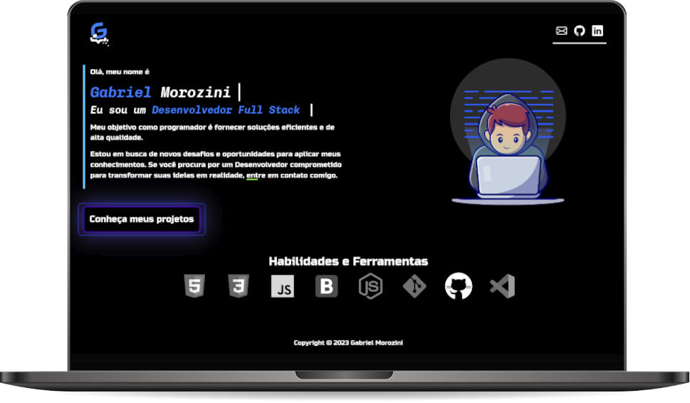

[Visualizar Página](https://gabrielmorozini.com.br/)

## 📚 Sobre o projeto 
Meu portfólio de Desenvolvedor Full Stack apresenta uma coleção dos meus projetos. Ele foi criado para destacar minhas habilidades em programação e tecnologias, como HTML, CSS, JavaScript e BootStrap.  

Através dele, procuro mostrar minhas habilidades em design, desenvolvimento e implementação, bem como minha capacidade de criar soluções escaláveis e eficientes.

Sendo uma representação precisa da minha jornada no mundo do desenvolvimento, ele apresenta uma série de projetos, incluindo trabalhos acadêmicos, projetos pessoais e desafios de programação. 

Além disso, com uma interface de usuário moderna e fácil de navegar, ele permite aos usuários descobrir rapidamente meu perfil profissional, minhas habilidades e minhas realizações. 

 

## 🖥️ Tecnologias utilizadas

* HTML
* CSS
* JavaScript
* Bootstrap

 

## ✒️ Licença
Esse projeto está sob licença MIT. Leia o arquivo <a href="./license" >LICENSE</a> para mais detalhes. 

  

  
  
       

